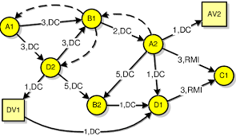

# Dependency Graph
This is a dependency graph. The very end product is SystemItem and an example of that could be seen in <I>app/tests/system_item.py</I>.
The goal of this is to manage systems that have a large number of calculations that should happen in special order when an external event happens. Basically this mimics an ecosystem (or Excel), if you will. There are a lot of components in an ecosystem and when an external stimulus enters the system, it triggers a lot of reactions until the system comes to an equilibrium again. Trading alpha and risk models are also similar to an ecosystem with a lot of factors that can change as a result of external market events (e.g. a new bid, a new trade, etc.).<BR>
    
The code is arranged as follows<BR>
* `DataItemBase`: This is an abstract class that defines an interface. Most of the interface throw "Not Implemented". It also contains hooks so the latter derived classes can implement dependency relationships. Please see <I>data_item_base.py</I> for more explanations.
    * `DataItem`: This is a concrete data item with actual value. The type of values it can be are limited to a set of fundamental types + "datetime". Also once a data item is declared, it cannot change type (like other Python variables) with a couple of exceptions. Please see <I>data_item.py</I> for more explanation.
    * `ContainerItem`: This is a tubular container of data items accessible by column name or index and row index. Because of this recursive definition, a container item column can be another container item. So, container item is really not tabular. It could take any arbitrary shape. Please see <I>container_item.py</I> for more explanation.
        * `SystemItem`: This is where dependency mechanism is implemented. You can define a dependency which signifies an independent column -> dependent column relationships between columns. Circular dependencies are allowed and handled properly by going around the circle once.  You can also define actions on columns. Please see <I>system_item.py</I> and <I>test_system_item.py</I> for more explanation and example.

```Python
from ..system_item import DependencyResult, SystemItem


class USTreasuryBond(SystemItem):
    """A crude simulation of a US treasury bond."""

    def __init__(self) -> None:
        """Initialize."""
        super().__init__()
        self.turn_dependency_off()
        self.add_float_column('price', 0)
        self.add_float_column('yield', 0)
        self.add_float_column('dv01', 0)
        self.add_integer_column('expiration', 0)
        self.wire()

    def price_to_yield(self, price_col: int, yield_col: int) -> DependencyResult:
        """Price to yield calculation."""
        price = self.get(column=price_col).get_value()
        yield_val = price / 100.0 * 1.5
        self.get(column=yield_col).set_value(yield_val)
        return DependencyResult.SUCCESS

    def yield_to_price(self, yield_col: int, price_col: int) -> DependencyResult:
        """Yield to price calculation."""
        yield_val = self.get(column=yield_col).get_value()
        price = yield_val / 1.5 * 100.0
        self.get(column=price_col).set_value(price)
        return DependencyResult.SUCCESS

    def price_to_dv01(self, price_col: int, dv01_col: int) -> DependencyResult:
        """Yield to price calculation."""
        price = self.get(column=price_col).get_value()
        self.get(column=dv01_col).set_value(price / 100.0)
        return DependencyResult.SUCCESS

    def dv01_action(self, dv01_col: int) -> DependencyResult:
        """Action taken when dv01 changes"""
        global SOMETHING_TO_CHANGE
        SOMETHING_TO_CHANGE *= 2
        return DependencyResult.SUCCESS

    def wire(self) -> None:
        """Setup the dependencies."""
        self.add_dependency(
            self.column_index('price'), self.column_index('yield'), self.price_to_yield
        )
        self.add_dependency(
            self.column_index('yield'), self.column_index('price'), self.yield_to_price
        )
        self.add_dependency('price', self.column_index('dv01'), self.price_to_dv01)
        self.add_action('dv01', self.dv01_action)


us_bond = USTreasuryBond()
us_bond.get(column='price').set_value(120.0)
us_bond.get(column='yield').set_value(1.5)  # We are in an inconsistent state now
us_bond.get(column='dv01').set_value(100.0)  # We are in an inconsistent state now
        
us_bond.turn_dependency_on()
# The circular price <-> yield dependency is being tested
us_bond.get(column='price').set_value(100.5)
# After the above line:
#     price == 100.5
#     yield == 1.50749999
#     dv01 == 1.005
```

# Test/Example
[Dependency Test](app/tests/test_system_item.py)<BR>
[DataItem/ContainerItem Test](app/tests/test_data_item.py)
    
## [License](LICENSE.md)
